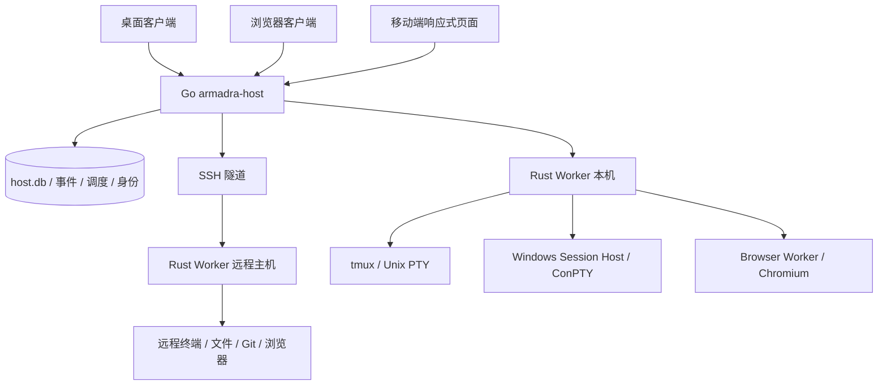

# 常驻 Host、Protobuf 与跨端服务设计

> 状态：目标方案，待实施。需求范围以[总纲](./canvas-platform-design.md)为准。
> 核心决定：Go 管理服务与业务状态，Rust 管理执行；前端是可随时断开的客户端。
> 2026-09-19：桌面壳已换成 Electron，本文提到 Tauri 的部分是换壳之前写下的，只作为当时的方案记录；壳的现状见 [Electron 迁移](./electron-migration.md) 与 [架构](../guides/architecture.md)。

## 1. 拓扑与职责



| 部件           | 唯一所有权                                                                   | 不负责                                                       |
| -------------- | ---------------------------------------------------------------------------- | ------------------------------------------------------------ |
| Go Host        | 身份、设备、工作空间/画布元数据、调度、依赖、审批、交接、GitHub 同步、事件流 | 创建第二套 PTY、直接解析所有 CLI、绕过 Worker 改执行主机文件 |
| Rust Worker    | 本机 CLI 启动、文件操作、Git 命令、Hook 归一化、进程测量、会话执行收据       | 任务看板、用户会话认证、第二份权威计划表                     |
| Session Host   | Windows ConPTY 句柄、无头屏幕、进程、附着者                                  | 画布、项目配置、GitHub 登录                                  |
| Browser Worker | 受管 Chromium 的会话、网页操作、画面与浏览器配置目录                         | 应用身份、任意远程 JS/RPC 执行入口                           |
| 客户端         | 交互、局部草稿、白板投影、渲染、订阅游标                                     | 调度时间、依赖完成判定、后台执行真相                         |

Go Host 不替换现有 Rust 终端引擎；将 `apps/runtime` 渐进拆为执行服务。避免一次重写所有终端、Git、Hook 适配造成回归。

建议目录：`apps/host/cmd/armadra-host`、`apps/host/internal/{identity,workspace,scheduler,events,github}`、`proto/armadra/v1/`、`packages/protocol/`、`crates/protocol/`。Windows 和浏览器执行器分别使用独立 Rust crate。Go 生成代码位于 `apps/host/gen/`。

## 2. 生命周期与部署

| 用户动作                 | 结果                                                                |
| ------------------------ | ------------------------------------------------------------------- |
| 关闭浏览器标签/移动页面  | 断开客户端；Host、计划、Worker 和会话继续                           |
| Command W / 关闭桌面窗口 | 关闭到托盘；前台隐藏，Host、Runtime 和会话继续；可重新显示          |
| Command Q / 托盘退出     | 明确停止配置的本机 Host 及桌面持有的 Runtime/受管会话，确认后退出   |
| 停止后台服务             | Host 停止派发新任务；标记调度暂停；持久会话按单独策略继续           |
| 停止全部会话并退出       | 与明确退出共享关停协调；失败不显示全部成功，不结束其他主机的服务    |
| 重启 Host                | 恢复计划、outbox 与执行收据；重认领会话                             |
| 注销/机器重启/断电       | 进程连续性不保证；开机/登录后按服务安装模式恢复，错过计划按策略处理 |

本机模式首次使用即启动独立的每用户 Host；可选“登录时启动”。macOS 使用用户 LaunchAgent、Linux 使用用户服务、Windows 使用当前用户登录启动的受管后台宿主。Linux 用户登出后持续运行需要 linger 或明确部署系统服务；Windows 无人登录运行需要单独的服务账号部署，不能声称用户后台进程天然跨注销存活。

用户更新的退出约定区分关闭前台与整体退出。当前桌面保留隐藏的 WebView，以保护尚未迁移的前端待运行任务和编辑草稿；后续视图销毁须在后台接管与草稿恢复完成后实现。普通浏览器关闭页面无权停止服务。

“服务器模式”以固定系统账号运行 Host/Worker，提供独立的服务安装、状态、日志、升级、卸载命令。首轮实现单 Host 单数据库实例，使用进程锁；不引入多副本调度。数据目录移除、凭据删除和停止会话与普通卸载后台自启动分开。

### 2.1 服务器模式命令（已实现）

`armadra-host install | uninstall | status | logs | upgrade | version`，实现见 [Host README](../../apps/host/README.md#服务器模式)。

- **只生成定义，不托管**：`install` 写出 launchd plist / systemd unit / Windows `sc.exe` 脚本，绝不调用 launchctl、systemctl、sc.exe，也不启用或启动任何东西；注册与否始终是运维的动作。`uninstall` 只删除本命令生成的那个文件，认不出来就拒绝，且不停止运行中的 Host。
- **账号显式**：必须给出 `--service-dir` 与 `--run-as`，不从当前用户推断，拒绝特权账号。定义内容由输入唯一决定，便于评审与配置管理比对。
- **定义不含凭据**：服务文件是可被服务管理器和运维读取的配置，只写运行参数；`--env` 拒绝 TOKEN / SECRET / PASSWORD / CREDENTIAL 一类名字，而不是静默丢弃。配对与会话材料仍只经各自命令的 stdout 返回。
- **状态与日志**：`status` 在原有输出上追加定义路径、运行账号与「磁盘上的定义是否仍等于本二进制生成的结果」；漂移只报告不修复，protobuf 形状不变。`logs` 只读日志尾部并有行数上限，内容原样输出、不做启发式脱敏。
- **升级有界且可回退**：`upgrade` 先校验候选文件本身，再在有界子进程里读候选的 `version` 比对协议主版本，任一失败都不动现有二进制；`--confirm` 之前只打印计划。确认后先经控制协议停止（不杀 PID）、旁写改名替换（失败回滚）、按记录的定义重启并报告状态。运行中且没有安装记录时拒绝升级，避免用猜出的参数改变监听面。

UI 托盘展示“后台正在运行 / 已停止”和计划数量；计划激活页显示宿主、时区与可运行条件。Host 自检涵盖端口、数据库、Worker、终端后端和凭据可用性。

## 3. Protobuf 传输分层

Protobuf 是唯一的跨进程业务契约，避免 TS DTO、Go struct、Rust struct 三份手写定义。白板文档、终端字节与图片不是强行展开成数千字段：作为带类型/版本/大小/校验和的专用载荷传输。

| 通道                | 传输                                       | 内容                                                |
| ------------------- | ------------------------------------------ | --------------------------------------------------- |
| 客户端 → Host 命令  | HTTPS POST，`application/x-protobuf`       | 一次请求/响应、取消、查询 operation                 |
| 客户端 ↔ Host 流   | WSS 二进制帧                               | 类型化控制帧、业务事件、终端字节、浏览器画面、订阅  |
| Host ↔ 本机 Worker | Unix socket / Windows 命名管道，长度前缀帧 | 相同版本化 Protobuf；操作系统 ACL 加本机凭据        |
| Host ↔ SSH Worker  | SSH 内转发的二进制流                       | 握手、命令、终端、文件块；不额外暴露远端端口        |
| 资产上传/下载       | HTTPS 的 Protobuf 分块请求                 | uploadId、offset、bytes、hash、finalize；可断点恢复 |

浏览器不被假设可以直接使用原生 gRPC 双向流。首版明确采用 HTTPS + WSS；未来接 gRPC 只作为内部传输适配，不再新增第二套业务语义。CDP、SSH、GitHub 等外部标准仍使用各自协议，Worker/Host 在边界转换。

“完整双端互传”涵盖工作空间、画布、会话、终端、文件、资产、Git、GitHub、计划、审批、用量和设备设置；凭据密钥不参与全量同步，客户端只接收引用及状态。OS 本地能力通过 HostCapabilities 显式声明。

### 3.1 核心信封草案

以下为接口形状示例，正式 `.proto` 在 M0 建立并生成三端代码；示例没有代表功能实现。

```proto
syntax = "proto3";
package armadra.v1;

message Scope {
  string host_id = 1;
  string workspace_id = 2;
  string execution_host_id = 3;
}

message CommandMeta {
  string request_id = 1;
  Scope scope = 2;
  string idempotency_key = 3;
  optional uint64 expected_revision = 4;
  int64 deadline_unix_ms = 5;
}

message SessionAddress {
  string session_id = 1;
  uint64 generation = 2;
}

message TerminalInput {
  SessionAddress session = 1;
  string input_id = 2;
  bytes data = 3;
  string writer_lease_id = 4;
}

message StreamFrame {
  string stream_id = 1;
  uint64 sequence = 2;
  string epoch = 3;
  oneof payload {
    TerminalInput terminal_input = 10;
    bytes terminal_output = 11;
    StreamAck ack = 12;
  }
}

message StreamAck {
  uint64 received_through = 1;
  uint32 available_credit_bytes = 2;
}
```

身份不由 `CommandMeta` 中的可伪造 principal 字段决定；Host 从已认证连接绑定用户与设备。Session 的目标范围在建立流时固定并逐请求检查，terminal_output 的字节不能切换到其他会话。

### 3.2 契约文件及完整表面

| 文件/服务          | 关键对象                                                             | 动作与流                                                                                                                                             |
| ------------------ | -------------------------------------------------------------------- | ---------------------------------------------------------------------------------------------------------------------------------------------------- |
| `common.proto`     | Scope、Revision、Error、Operation、Capabilities                      | Hello、GetOperation、Cancel、Heartbeat                                                                                                               |
| `identity.proto`   | Device、Principal、Grant、CredentialRef                              | Pair、Refresh、Revoke、ListDevices                                                                                                                   |
| `canvas.proto`     | CanvasWorkspace、Canvas、Node、Edge、Annotation、AssetRef、Ownership | ListWorkspaces / PutWorkspace / DeleteWorkspace、ListCanvases、GetDocument / SaveDocument / DeleteCanvas、SubscribeEvents、GetSnapshot、GetOwnership |
| `session.proto`    | Session、Run、LaunchSpec、ContextUsage                               | Create、Start、Attach、Input、Resize、Signal、Close、Resume                                                                                          |
| `agent.proto`      | AdapterCapabilities、HookEvent、Approval、Handoff                    | Resolve、Report、Answer、Message、Prepare/AcceptHandoff                                                                                              |
| `automation.proto` | Schedule、Run、Activation、AgentActivity                             | Create、Edit、Activate、Pause、RunNow、Observe、History                                                                                              |
| `filesystem.proto` | WorkspacePath、FileStat、FileVersion、Transfer                       | List、Read、Write、Rename、Delete、Search、Watch、Upload                                                                                             |
| `git.proto`        | RepoState、Diff、Commit、Ref、Worktree、GitOperation                 | Status、Stage、Commit、Branch、Fetch、Pull、Push、History 等                                                                                         |
| `github.proto`     | Issue、PullRequest、Mapping、Check、Review                           | Query、ChangeState、MapStatus、CreatePR、Review、Merge                                                                                               |
| `browser.proto`    | BrowserSession、ElementRef、Action、Frame                            | Create、Navigate、Read、Act、Capture、Subscribe、Close                                                                                               |
| `resources.proto`  | HostMetrics、SessionMetrics、PowerLease                              | Read、Subscribe、SetPolicy、ReleaseLease                                                                                                             |
| `presence.proto`   | Participant、Cursor、Focus、WriterLease                              | Join、Leave、Update、Acquire/Release；先预留                                                                                                         |
| `settings.proto`   | Preferences、KeyBinding、AccountBinding                              | Read、Patch、Validate、Export/Import                                                                                                                 |
| `updates.proto`    | Release、Compatibility、UpdateJob                                    | Check、Download、Verify、Apply；先预留                                                                                                               |

### 3.3 版本、重放与流控

- 协议包 `v1`；Hello 协商客户端支持范围、Host 版本、功能位、画布快照版本、最大帧与流预算。主版本不兼容拒绝写入并返回升级说明。
- 字段号永不复用，删除字段保留 `reserved`；枚举 0 为 UNSPECIFIED；需要区分未传和清空的字段使用 optional/FieldMask/明确 Clear 动作。参考 [Protobuf proto3 兼容规则](https://protobuf.dev/programming-guides/proto3/)。
- TS 中 64 位序号使用 bigint 或生成器提供的无损表示，不转成普通浮点 Number。二进制消息转 JSON 可能丢未知字段，兼容桥不做 JSON 往返；不同生成器的未知字段保留行为须通过契约测试验证。
- 业务事件在同一 Host 内按 durable sequence 排序，保留建议起始值 7 天；事件与数据库改动同事务写 outbox。超出保留期返回 SNAPSHOT_REQUIRED，客户端先应用带 revision 的快照，再从其游标继续。
- 终端输出按 session/generation/stream epoch 排序，与业务事件分流；断线用屏幕快照 + 后续字节接续，不能以业务日志替代终端流。
- 默认控制帧上限 1 MiB、文件块 256 KiB、单慢订阅者队列预算 4 MiB，握手允许向下协商。超限错误清晰；协议测试覆盖最大值，发布前按内存测量调整。
- 慢终端订阅者超过预算后 reset/resnapshot，不让 CLI 等待手机网络；浏览器丢旧画面、保留最新帧；审批与控制消息使用独立高优先级队列。
- 幂等键按 principal/scope/action 命名空间存储，同时校验请求摘要；相同键不同内容拒绝。UI 重试不会变成第二次提交或第二个会话。
- ACK 仅证明相应层收到，不能证明 Shell 命令执行完成；session input 的不确定结果不自动重发。副作用协议详见自动化设计。

### 3.4 错误与长操作

统一错误：`INVALID_ARGUMENT / UNSUPPORTED / UNAUTHENTICATED / PERMISSION_DENIED / NOT_FOUND / CONFLICT / STALE_GENERATION / DISCONNECTED / BUSY / TIMEOUT / RESOURCE_EXHAUSTED / UNKNOWN_OUTCOME / SNAPSHOT_REQUIRED`。

错误包含稳定代码、可本地化参数、operationId、可选 retryAfter 和 retrySafety，不包含密钥。长操作状态为 accepted/running/waiting-input/succeeded/failed/cancelled/unknown；取消请求不等于副作用已回滚。Clone 下载、Git 冲突、浏览器下载和交接转移均能查询进度与失败原因。

## 4. 数据、写入与迁移

| 存储                   | 所有者               | 内容                                                                      |
| ---------------------- | -------------------- | ------------------------------------------------------------------------- |
| `host.db`              | Go Host 唯一写者     | 工作空间/画布、会话意图、计划、运行记录、身份、审批、交接、事件、远端缓存 |
| `worker.db`            | 对应 Worker 唯一写者 | 操作收据、generation、Hook outbox、执行请求与恢复标记                     |
| Session Host journal   | Session Host         | ConPTY 存活清单、输入收据、屏幕检查点索引                                 |
| Workspace 文件系统     | Worker               | 用户源文件、Git 仓库、`.armadra/assets`、交接材料                         |
| OS 凭据存储/服务密钥库 | 所在主机的凭据服务   | API token、账号认证、设备密钥；Host DB 仅引用                             |

不存在 Go 与 Rust 同时写 `canvas.db` 的长期方案。迁移步骤：

1. 先把现有 HTTP 客户端调用包在 `HostClient` 抽象中，建立协议回环和能力读取。
2. 旧 Rust Runtime 仍为权威时，Go 只作兼容入口；不开第二个调度器，不双写业务表。
3. 进入维护窗口，停止业务写入并做 SQLite 一致性备份（包含 WAL 的一致视图），记录当前迁移版本，不假定只有初始 schema。
4. 导入 `host.db`，保留原 ID 与时间；核对行数、引用、白板 hash、资产、审批和消息队列。生成可复核导入报告。
5. 以 epoch 切换写入所有权，旧 Runtime 的业务写入拒绝；Worker 接管执行接口，Host 重认领存活会话。
6. 新 Host 开放写入后，回滚需要反向迁移/维护窗口，不能直接用旧数据库覆盖新数据。旧库保留只读备份。

### 4.1 画布写入所有权实现状态（H01 第一阶段）

已实现：`canvas.proto` 三语言产物、fixture 与契约测试；Host 侧画布业务存储（复用 revision 实体 / 操作收据 / 事件 outbox，新增编号迁移 v5 的 `write_ownership` 单行记录）；HTTPS `armadra.v1.CanvasService/*` 按 `canvas:read` / `canvas:write` 与工作空间收窄，变更另需 CSRF；事件按 durable sequence 续订，游标低于保留下限返回 `SNAPSHOT_REQUIRED`、高于水位返回 `CURSOR_AHEAD`，快照带可续订的 sequence；保存以整篇文档为一次事务，仅写入真正变化的对象并返回幂等收据（重放同一 operationId 返回原收据，改内容则 CONFLICT）。

切换按 §4 的五步执行，由 `armadra-host ownership switch|rollback|status` 触发，命令持有数据目录锁——运行中的 Host 必须先停止，这就是维护窗口。第 4 步把 staging 的 `legacy.*` 行投影成画布实体，并同时与导出清单和原始行两侧逐项比对（ID、位置与尺寸、Frame 嵌套、上下文链接、白板摘要、标注、受管资产哈希）；任一差异即中止，且此时尚未写入任何所有权状态。第 5 步经现有 Worker stdio 协议（`--canvas-database FILE`，能力位 `canvas.ownership.v1`）下发 epoch；请求同时带上「Host 认为对方存的 epoch」，因此重复请求幂等、过期请求被拒。

失败处理：应答丢失时 Host 重新读取 Runtime 实际存了什么并据此收敛；Runtime 明确拒绝时恢复到切换前的 settled 记录；两次读取都失败时维护窗口保持打开（`switching` + `ownership.switch.unknown`），两侧继续拒绝写入，由操作者重跑同一条命令收敛——这是唯一不 settle 的结果，且被显式记录而不是猜测。

未实现：HTTPS 上的切换/回滚入口（只有 CLI）；把 Host 的反向导出包重新导入 `canvas.db`——因此 Host 在持有期间产生过画布事件时回滚会被拒绝，除非操作者显式接受「只导出」。会话、Agent、文件系统、Git 的业务表面仍未迁移。

画布普通节点是类型化对象；自由图形快照是 `schemaVersion + engineVersion + bytes + digest`。业务节点投影、绑定和白板 blob 同一次 mutation 原子保存，禁止互相覆盖。Node ID 可映射到 shape ID，但浏览器与移动端不解析内部结构也能读取节点列表。

首次跨设备编辑采用 Canvas 级编辑租约及 revision CAS：多个设备可查看，只有持租约者编辑画布；不把本地全量快照互相最后写入当作多人协同。未来按对象 revision、tombstone、actorId 和 operationId 演进；引入白板文档同步或 CRDT 前先冻结协议适配层。终端输入租约独立于画布编辑租约。

## 5. 本机对外服务与 SSH

两种连接可以同时存在，但 UI 必须标明控制 Host 与执行主机：

- 设备远程接入本机：手机/浏览器 → 本机 Go Host → 本机 Worker。
- 本机管理远程项目：本机 Go Host → SSH 隧道 → 远端 Worker。

SSH 接入流程：保存主机配置 → 验证 host key → 探测 OS/架构/工具 → 选择远程项目目录 → 安装或选择签名校验后的 Worker → 建立协议连接 → 获取 capabilities。首次主机指纹/指纹变化需用户处理，不能自动关闭校验。

远程路径使用 `WorkspacePath { executionHostId, workspaceId, relativePath }`；传输文件时显式区分本机上传、远端文件、下载目标。文件、Git、浏览器和账号都在同一执行主机解析，不把本地绝对路径或 HOME 发送后假定远端可用。

远端 Worker 不运行平台调度器；计划只在所属 Host 执行。若要求控制电脑关闭后远端仍调度，用户必须把项目和计划迁移到远端常驻 Host，不能仅靠 SSH Worker 宣称持续调度。

### 5.1 远端 Worker 与统一执行位置实现状态（H02）

工作空间带 `executionHostId`（迁移 0006，空串＝本机）。非空时指向配置了 `worker.path` 的 `settings.ssh.hosts[]`，Runtime 以 `ssh -o BatchMode=yes … <远端二进制> worker --stdio [--state-dir …]` 启动远端 Worker，复用现有 stdio 长度帧 Protobuf 协议。远端二进制路径与状态目录按 `identityFile` 同一规则校验：绝对路径、无空白与 shell 元字符，否则远端登录 shell 会把它切成多个参数。

握手要求 `runtime_version` 与控制端完全一致并声明 `remote.execution.v1`；二进制缺失、版本不符或主机没配 Worker 一律 `UNSUPPORTED`，不回退本机。重连有界：3 次尝试、250ms/1s/4s 退避，随后停 30 秒；单连接互斥同时充当该主机的 Git 操作队列。已写出后失联的请求返回 `UNKNOWN_OUTCOME`，只有只读操作在重建连接（并重新注册 root）后重放。

协议新增：`WorkerWriteFileRequest`（`expected_sha256` 为 optional，缺省＝仅新建，保证编辑器保存带内容版本）、`WorkerServiceRequest/Response`（封闭的 `WorkerServiceOperation` 枚举 + 本构建自身的 camelCase JSON 载荷 + 执行主机原样返回的 HTTP 状态）。JSON 载荷是**版本锁**而非跨版本契约：两端由握手固定为同一构建，字段号保留以便将来换成类型化消息。

已经远端执行：文件列表/读/写/版本/监听、快速打开、项目搜索、`git status/diff/head-commit/stage/unstage/resolve/revert/commit/init`。远端监听是 2 秒轮询（`WATCH_POLL`），原地替换只能报 `modified`——本机用的 dev/inode 信号在远端没有对应物。`POST /api/workspaces/remote` 用远端 root 注册证明并冻结规范路径；`POST /api/ssh/hosts/{id}/worker/test` 回报远端 Worker 的平台、架构与版本。

未做：Git 仓库面板（分支、历史、worktree、stash、操作队列）、下载/上传、文件新建改名删除、资产导入在远端工作空间返回 501 并写明功能名；工作空间的执行主机在打开时确定，之后不可更改；SSH 认证与 host key 仍由 `ssh` 自己处理，凭据不入库。

SSH 断线：已有远端 tmux/Session Host 保持；重连先核对 Worker epoch、会话 generation、Hook outbox 与执行收据。连接中断期间不乐观显示命令成功，过期终端输入不回放。远程文件编辑可保留本机草稿，恢复时比较版本后保存。

## 6. 身份、安全与后续多人接口

本机默认回环；开启对外服务后使用 TLS、受限监听地址与独立设备认证。Protobuf 不提供加密和授权。浏览器使用 HttpOnly/Secure 会话 Cookie、CSRF 与 Origin 校验；WebSocket upgrade 同样检查身份和 Origin。设备 token 不放 URL。

配对码一次性、短期有效，绑定目标 Host 指纹，确认设备名后颁发可撤销凭据。移动二维码只包含短期配对材料，不包含长期 token。远程访问不提供匿名文件/终端入口。

角色预留 owner/operator/viewer；首版是同一 owner 的多个设备，不伪造团队账号。权限细分 canvas:read/write、terminal:read/write、files:read/write、git:write、github:write、browser:control、automation:manage、credential:use。计划使用激活者身份及凭据授权，账号撤销后停止新派发。

Presence 预留参加者列表、光标、焦点节点、正在输入、租约与失联时间。后续多人接入时先读取设备真实主体再展示头像；显示名称不作为授权身份。光标不进永久事件日志。

敏感动作按真实目标做授权：终端输入/审批检查 generation，Git 检查仓库与 ref，文件检查规范化路径/符号链接，浏览器检查 session 和作用域。Hook per-node token 仅授予所属会话的报告和受限协作，不能当作 Host 管理凭据。

### 6.1 预留契约实现状态（H04 / S02）

`presence.proto` 有 `Presence`、`WriterLease` 与不透明载荷的 `Mutation` 信封，方法为 Subscribe / Acquire / Release / ApplyMutation；`account.proto` 有 `AccountRef`、`CredentialBinding`（只有 `credentialRef`，没有可放密钥的字段）与节点绑定读写。三语言产物、fixture 与契约测试就位，覆盖未知枚举、optional 与 64 位边界。

Host 对 `armadra.v1.PresenceService/*` 与 `armadra.v1.AccountService/*` 一律返回 501 `UNSUPPORTED` 及稳定原因键 `host.capability.reserved`；本版本未定义的方法名仍是 `NOT_FOUND`。Hello 新增 `capability_status`，显式把 `presence` 与 `accountBinding` 报为 unsupported——`capabilities` 只列真正可用的能力，`capabilityStatus` 为空也不等于支持。前端「设置 → 后台服务」的连接详情展示这两条，未报告时显示「未报告」。

未实现：以上任何操作的实际行为、账号列表与切换、光标/焦点同步、租约仲裁。协议 minor 仍为 1：可协商的表面没有变化，预留能力由 `capability_status` 发现。

## 7. 移动与桌面能力矩阵

| 功能            | 桌面           | 浏览器               | 移动网页                                   |
| --------------- | -------------- | -------------------- | ------------------------------------------ |
| 画布/节点操作   | 完整           | 完整                 | 触摸画布 + 单节点焦点模式                  |
| 终端输入/审批   | 完整           | 完整                 | 软键盘工具条、Ctrl/Alt/Esc/Tab、可折行查看 |
| 文件/Git/GitHub | 面板           | 同一业务面板         | 全屏列表/详情，不依赖右键                  |
| 浏览器          | 受控浏览器画面 | 同会话画面           | 同会话画面 + 文本操作入口                  |
| 文件选择        | OS 选择器      | Host 目录浏览 + 上传 | Host 目录浏览 + 上传                       |
| 系统快捷键/托盘 | 宿主支持       | 无 OS 全局能力       | 无 OS 全局能力                             |
| 调度与防休眠    | 由执行宿主提供 | 由执行宿主提供       | 由执行宿主提供                             |
| 通知            | OS 通知        | 权限允许时网页通知   | 应用内；后台推送作为后续能力               |

移动浏览器被系统冻结后不保证持续 socket；重开恢复游标和快照。不能用浏览器 Screen Wake Lock 代替执行主机防休眠。

## 8. 验收与可观测性

- Go/TS/Rust 对 optional、oneof、未知枚举、64 位序号、UTF-8、二进制载荷和版本升级做契约测试。
- 断线发生在写入前、执行后 ACK 前、快照切换中，均有明确恢复行为；不得自动重复副作用。
- 两个客户端并发修改同一画布时租约/CAS 生效；慢订阅者不能阻塞另一个终端或调度器。
- 同一项目在桌面、浏览器、手机显示同一个会话和文件；跨 Host 路径误用测试必须拒绝。
- Host/Worker 记录 requestId、operationId、executionHostId、耗时、队列长度、失败代码；日志默认隐藏终端输入和文件正文。
- 对外服务关闭后远程设备不能新连接；撤销设备立即终止流；已有计划按授权状态重新检查。
- 所有未来多人/多账号/更新 RPC 在功能关闭时返回 UNSUPPORTED，而非空数据伪成功。
