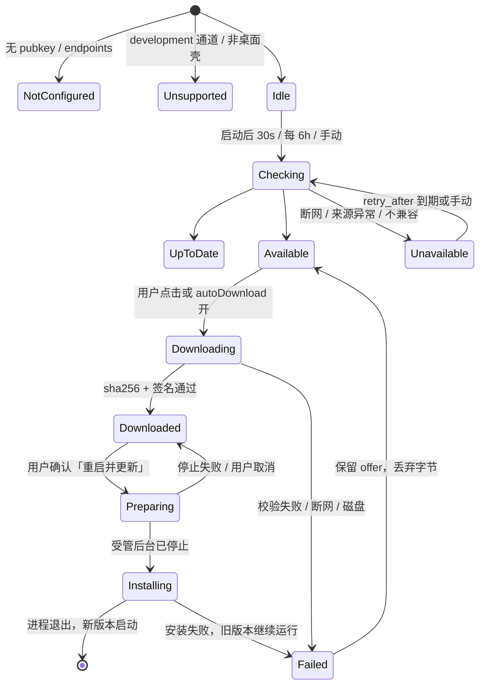

> 状态：目标设计。本文是 S03（[平台总纲 §3](./canvas-platform-design.md#3-范围矩阵)）与路线图 [§3.8](../status/feature-roadmap.md#38-github)、[§3.12](../status/feature-roadmap.md#312-桌面壳服务集成与项目结构本轮新增详见-44-45) 中「下载 / 安装 / 签名发布 / 真正注册系统服务」的完整方案；已交付部分以 [实施记录 S03 行](../status/platform-implementation-status.md) 与源码为准。
> 2026-09-19：桌面壳已换成 Electron，本文提到 Tauri 的部分是换壳之前写下的，只作为当时的方案记录；壳的现状见 [Electron 迁移](./electron-migration.md) 与 [架构](../guides/architecture.md)。

# 应用发布、自动更新与服务器模式安装

## 0. 结论

| 结论                                                                                                                                                                            | 依据                                                                                                        |
| ------------------------------------------------------------------------------------------------------------------------------------------------------------------------------- | ----------------------------------------------------------------------------------------------------------- |
| **GitHub Releases 是唯一发布来源**；Host 已能读它，桌面 updater 与 Host `upgrade` 都只消费同一份 Release，不另建更新服务器                                                      | [终端宿主 §11](./terminal-host-design.md#11-更新与-github-发布预留)、`apps/host/internal/updates/source.go` |
| **一把 minisign 密钥签所有产物**：桌面包由 Tauri updater 验签，Host/Worker/Hook/Session Host 压缩包与 `SHA256SUMS` 由 Host `upgrade` 验签；公钥随二进制发布，私钥只在 CI secret | `tauri.conf.json` 注释、[Tauri Updater](https://v2.tauri.app/plugin/updater/)                               |
| **安装永远是人的动作**：检查可自动，下载需开关，应用与重启必须确认；检查失败、未配置、本地构建都不显示「已是最新」                                                              | 平台总纲 S03 验收、`updates.proto` 注释                                                                     |
| **谁启动的 Host 谁更新**：桌面持有的 Host 随桌面包更新；服务器模式的 Host 只由 `armadra-host upgrade` 更新；两者互斥由 Host 记录的启动方决定，不靠猜                            | [Host 与协议 §2.1](../history/host-protocol-design.md#21-服务器模式命令已实现)                              |
| **真正注册系统服务是新的显式子命令** `install --register` / `uninstall --unregister`，需要 `--confirm`、提权与定义文件未漂移三项同时成立                                        | `apps/host/cmd/armadra-host/service.go`、`internal/servicedef/*`                                            |
| **受管 Host 的升级顺序改为「先替换、后停止」**：让 KeepAlive / Restart 拉起的就是新二进制；无托管的 Host 保持现有「先停止、后替换」                                             | §3.3，现状 `upgradeHost` 在 KeepAlive 下存在竞态                                                            |
| 协议不新增 RPC；只给 `UpdateArtifact` / `CheckForUpdateRequest` 加 `component` 字段（minor 1→2），`DownloadUpdate` / `ApplyUpdate` 本轮继续 UNSUPPORTED                         | §1.5                                                                                                        |

术语：「桌面包」= Tauri bundle（内含 Host/Worker/Hook sidecar）；「组件包」= 单独发布的 Host/Worker/Hook/Session Host/Web 压缩包；「目标」= `<os>-<arch>`，与 `updates.proto` 的 `target` 同拼写。

## 1. 发布流水线

### 1.1 版本与来源

| 项目       | 规则                                                                                                                                                                                                     |
| ---------- | -------------------------------------------------------------------------------------------------------------------------------------------------------------------------------------------------------- |
| 唯一版本源 | 根 `Cargo.toml` 的 `[workspace.package].version`。`tauri.conf.json`、根与 `apps/desktop` 的 `package.json`、Host `-ldflags -X …/buildinfo.Version` 必须相等，`scripts/release/version.mjs check` 拦截    |
| 标签       | `v<major>.<minor>.<patch>[-beta.N]`；带预发布后缀的标签在 GitHub 打 `prerelease`，Host 据此归入 BETA（`source.go` 已实现）                                                                               |
| 通道       | `stable` 只看最终版；`beta` 看最新（含预发布）；`development` 是没有经过 CI 的本地构建，永不更新（`ReasonDevelopment` 已实现）。CI 通过 `ARMADRA_RELEASE_CHANNEL` 注入，桌面壳与 Host 都从构建信息读取   |
| 发布来源   | `https://api.github.com/repos/yovinchen/Armadra`。Host 用 `--updates-source` 配置；桌面壳在 CI 打包时经 `tauri build --config` 覆盖注入 `plugins.updater.endpoints`，源码里的 `tauri.conf.json` 保持为空 |
| 发布形态   | CI 只创建 **draft** Release；人工审阅产物清单与说明后点击发布。Host 已跳过 draft，所以未发布前任何客户端都看不到                                                                                         |
| 说明       | Release body = `CHANGELOG.md` 对应段落 + 一个 ` ```armadra-compatibility ` 围栏（§1.4）。围栏之外的内容 Host 不读                                                                                        |

### 1.2 产物矩阵

| 组件                                     | 目标                             | 资产名                                                                                          | 用途                                                                                               |
| ---------------------------------------- | -------------------------------- | ----------------------------------------------------------------------------------------------- | -------------------------------------------------------------------------------------------------- |
| 桌面安装包（人工安装）                   | darwin-aarch64 / darwin-x86_64   | `Armadra_<ver>_<target>.dmg`                                                                    | 首次安装                                                                                           |
|                                          | windows-x86_64 / windows-aarch64 | `Armadra_<ver>_<target>-setup.exe`（NSIS）、`Armadra_<ver>_<target>.msi`                        | 首次安装；MSI 不参与自动更新                                                                       |
|                                          | linux-x86_64 / linux-aarch64     | `Armadra_<ver>_<target>.AppImage`、`.deb`、`.rpm`                                               | deb/rpm 由包管理器更新，不参与自动更新                                                             |
| 桌面更新包（Tauri updater）              | 同上六个目标                     | macOS `Armadra_<ver>_<target>.app.tar.gz`；Windows `-setup.exe`；Linux `.AppImage`，各配 `.sig` | `bundle.createUpdaterArtifacts: true` 产出                                                         |
| 更新清单                                 | 全平台一份                       | `latest.json`                                                                                   | Tauri 静态清单格式，`platforms` 键即 `<target>`                                                    |
| Host                                     | 六个目标                         | `armadra-host_<ver>_<target>.tar.gz` / Windows `.zip`，各配 `.sig`                              | 服务器模式 `upgrade`                                                                               |
| Worker（当前二进制名 `armadra-runtime`） | 六个目标                         | `armadra-runtime_<ver>_<target>.tar.gz` / `.zip` + `.sig`                                       | 同上；目录改名后资产名随 [仓库结构 §2](./repository-structure.md#2-目标结构) 改为 `armadra-worker` |
| Hook                                     | 六个目标                         | `armadra-hook_<ver>_<target>.tar.gz` / `.zip` + `.sig`                                          | 同上                                                                                               |
| Session Host                             | windows-x86_64 / windows-aarch64 | `armadra-session-host_<ver>_<target>.zip` + `.sig`                                              | 只在 Windows 存在（`sidecar-targets.mjs`）                                                         |
| Web 静态产物                             | 无目标                           | `armadra-web_<ver>.tar.gz` + `.sig`                                                             | 服务器模式 `--serve-web` 目录                                                                      |
| 校验清单                                 | 全平台一份                       | `SHA256SUMS`、`SHA256SUMS.sig`                                                                  | 人工核对与镜像                                                                                     |

资产名必须让 `source.go` 的 `assetTarget` 能读出目标（`<os>-<arch>` 前面是 `_`），并让 `.sig` 与资产同名。GitHub 资产的 `digest` 字段提供 sha256，CI 在 `assemble` 作业里再次用本地计算值核对。

### 1.3 CI 作业（`.github/workflows/release.yml`）

| 作业       | 触发 / Runner                                                                                        | 内容                                                                                                                                                                                             |
| ---------- | ---------------------------------------------------------------------------------------------------- | ------------------------------------------------------------------------------------------------------------------------------------------------------------------------------------------------ |
| `verify`   | `push tags v*`；ubuntu                                                                               | `scripts/release/version.mjs check`（标签 = 版本）、`pnpm check`、`pnpm test`、`cargo test --workspace`、`go -C apps/host test ./...`、`pnpm protocol:check`                                     |
| `build`    | 矩阵：macos-14 (arm64)、macos-13 (x64)、windows-2022、windows-11-arm、ubuntu-24.04、ubuntu-24.04-arm | `pnpm --filter @armadra/desktop prepare:sidecar`（本机 triple）→ `tauri build`（`TAURI_SIGNING_PRIVATE_KEY[_PASSWORD]` 注入）→ 打包组件 tarball → 上传 workflow artifact                         |
| `web`      | ubuntu                                                                                               | `pnpm --filter @armadra/web build` → `armadra-web_<ver>.tar.gz`                                                                                                                                  |
| `assemble` | 依赖以上；ubuntu                                                                                     | 下载全部 → `SHA256SUMS` → minisign 签组件包与 `SHA256SUMS` → `updater-manifest.mjs` 生成 `latest.json`（读各 `.sig`）→ `compatibility.mjs` 渲染围栏 → `gh release create --draft [--prerelease]` |
| `notarize` | 仅当 `APPLE_*` secret 存在（macOS 两个 runner 内）                                                   | Tauri 内建的签名 + 公证；secret 缺失时作业 **跳过并在 Release 说明顶部标注「未公证」**，不阻断发布                                                                                               |

Windows Authenticode 同理：`WINDOWS_CERT_*` 缺失就跳过并标注。两者都不是 updater 验签的替代，只影响首次安装时的系统提示。

### 1.4 兼容范围声明

Release 说明中的围栏，由 `scripts/release/compatibility.json` 渲染，键名与 `source.go` 的 `compatibilityDocument` 一致：

````text
```armadra-compatibility
{"minimumInstalled":"0.2.0","protocolMajor":1,"minimumProtocolMinor":2}
```
````

| 版本变化                        | 允许的改动                                       | `compatibility.json` 要求                                                                                           |
| ------------------------------- | ------------------------------------------------ | ------------------------------------------------------------------------------------------------------------------- |
| patch                           | 无协议改动，无新迁移                             | `minimumInstalled` 不变                                                                                             |
| minor                           | 协议 minor +1（只增字段 / 方法），可新增编号迁移 | `minimumInstalled` = 能把数据库迁到本版的最低版本（通常上一 minor 的首个 patch）；`minimumProtocolMinor` 按实际需要 |
| major（0.x 期间为破坏性 minor） | 协议 major +1；旧 Hello 被拒绝                   | `protocolMajor` 更新；上一 major 的最后一版发布时补 `maximumInstalled`，让旧线不会被新线「提供」                    |

Go 测试锁定 `compatibility.json.protocolMajor == server.ProtocolMajor`，`minimumProtocolMinor <= server.ProtocolMinor`；`version.mjs check` 锁定 `minimumInstalled <= 当前版本`。围栏缺失的 Release 会被 Host 报 `COMPATIBILITY_REFUSED`（已实现），这是设计意图，不是缺陷。

### 1.5 协议改动（唯一一次）

| 文件                                   | 改动                                                                                                                                                                                            |
| -------------------------------------- | ----------------------------------------------------------------------------------------------------------------------------------------------------------------------------------------------- |
| `proto/armadra/v1/updates.proto`       | `UpdateArtifact` 加 `string component = 6`（`desktop` / `host` / `worker` / `hook` / `session-host` / `web` / `manifest`）；`CheckForUpdateRequest` 加 `string component = 5`，空值 = `desktop` |
| `apps/host/internal/updates/source.go` | `artifacts()` 从资产名前缀推断 `component`；`artifactFor` 同时匹配 `target` 与 `component`；`latest.json`、`SHA256SUMS` 作为 `component=manifest` 且 `target` 为空                              |
| 协议版本                               | `server.ProtocolMinor` 1→2；三端契约测试与 fixture 各加一条含 `component` 的样本                                                                                                                |

没有这个字段，同一目标下桌面包与 Host 包无法区分，`artifactFor` 只能返回第一个匹配。

## 2. 桌面自动更新

### 2.1 状态机



| 状态          | 谁给出                                           | 持久化                             | 用户可做                     |
| ------------- | ------------------------------------------------ | ---------------------------------- | ---------------------------- |
| NotConfigured | 壳读 `plugins.updater`（已实现）                 | 否                                 | 无；显示缺哪一半             |
| Unsupported   | 构建信息 `channel=development`                   | 否                                 | 无；显示「本地构建」         |
| Checking      | 壳先问 Host `CheckForUpdate`，再问 Tauri updater | 否                                 | 取消                         |
| UpToDate      | 两者都回答「无更新」                             | 记录 `lastCheckedAt`               | 再次检查                     |
| Available     | Host 给 `ReleaseInfo`，Tauri 给 `Update`         | 记录 offer（版本、目标、`sha256`） | 下载 / 查看说明 / 跳过此版本 |
| Downloading   | Tauri `download()` 进度回调                      | 否                                 | 取消（丢弃）                 |
| Downloaded    | 字节落在 `<数据目录>/updates/<ver>/`             | 记录路径与摘要                     | 重启并更新 / 稍后            |
| Preparing     | 壳调用 `DesktopLifecycle` 停止受管后台           | 否                                 | 取消（回 Downloaded）        |
| Installing    | Tauri `install()`                                | 写 `pending-restart.json`          | 无                           |
| Failed        | 任意阶段的稳定原因键                             | 记录原因与时间                     | 重试 / 打开发布页手动安装    |
| Unavailable   | Host `UNAVAILABLE` + `reason_code`               | 记录 `retry_after`                 | 稍后重试                     |

原因键只用稳定 token（`sourceUnreachable`、`signatureMismatch`、`digestMismatch`、`diskFull`、`hostStopFailed`、`installFailed`），不带 URL 或响应体（`updates.rs` 已定此规矩）。

### 2.2 两次检查怎么合并

| 问题                 | 决定                                                                                                                                                                                                                           |
| -------------------- | ------------------------------------------------------------------------------------------------------------------------------------------------------------------------------------------------------------------------------ |
| 通道与兼容范围谁判断 | Host。Tauri updater 不懂 beta 通道与 `armadra-compatibility`，所以壳先拿 Host 的 `AVAILABLE` 才继续；Host 说 `COMPATIBILITY_REFUSED` 时壳不会去问 Tauri                                                                        |
| 清单 URL 从哪来      | 从 Host 返回的 `component=manifest` 资产 URL（同一 Release 的 `latest.json`）。壳用 `UpdaterBuilder::endpoints` 在运行时覆盖，因此 beta 版本也能走 updater；`tauri.conf.json` 里 CI 注入的 stable 地址只是 Host 不可用时的兜底 |
| 签名谁验             | 只有 Tauri updater（minisign 公钥）。Host 的 `signature.state=PRESENT` 只是「有 `.sig`」，壳不据此信任任何东西                                                                                                                 |
| 摘要谁验             | 壳在 `download()` 结束后按 Host 给的 `sha256` 再算一次；不一致 → `digestMismatch`，即便签名通过也丢弃（说明 Release 资产被替换过）                                                                                             |
| 浏览器模式 / 无 Host | 只显示 Host 检查结果与「手动安装」说明（现状），壳侧状态为 Unsupported                                                                                                                                                         |

### 2.3 与 Host / Runtime 生命周期的协调

| 步骤           | 动作                                                                                                                                                                         | 失败处理                                                                |
| -------------- | ---------------------------------------------------------------------------------------------------------------------------------------------------------------------------- | ----------------------------------------------------------------------- |
| 确认点         | 对话框列出：运行中的会话数、活跃的自动化计划数、「终端会话会保留，计划会暂停到重启后」；按钮「重启并更新」/「稍后」                                                          | 取消回 Downloaded                                                       |
| 停止受管后台   | 复用 `DesktopLifecycle` 的退出序列（停止配置目录的 Host → 停止桌面持有的 Runtime）；**只停 Host 自报 `launcher=desktop` 的实例**（§3.4），服务器模式的 Host 不碰             | 任一步失败 → `hostStopFailed`，不进入 Installing                        |
| 会话           | tmux / Session Host 由 [终端宿主 §11](./terminal-host-design.md#11-更新与-github-发布预留) 约定独立存活；Windows Session Host 二进制在桌面包内被替换，旧会话继续由旧进程持有 | —                                                                       |
| 安装           | Tauri `install()`：macOS 替换 `.app`，Windows 运行 NSIS `passive`，Linux 替换 AppImage；随后 `app.restart()`                                                                 | 失败 → Failed，旧版本未动（Tauri 在替换前完成解压与验签）               |
| 重启后健康检查 | 新壳启动时读 `pending-restart.json`：比对自身版本 = 期望版本 → 启动 Host → Hello 报告的 Host 版本 = 期望版本 → 清除文件并通知「已更新到 x」                                  | 任一不符 → 显示「更新未完成」并给出上一版安装包链接（来自记录的 offer） |
| 数据库         | 新 Runtime / Host 启动即执行迁移；迁移失败拒绝启动（`AGENTS.md` 规则），壳显示「需要回到 x 版本或恢复备份」，不自动清库                                                      | —                                                                       |

桌面回滚不自动化：macOS / Windows 没有可靠的原地回退，且数据库可能已迁移。可靠的做法是 `minimumInstalled` / `maximumInstalled` 在发布侧阻止跨迁移边界的往返，壳只负责把上一版安装包链接留在失败提示里。

### 2.4 离线、断网与限速

| 情形            | 行为                                                                                                                 |
| --------------- | -------------------------------------------------------------------------------------------------------------------- |
| 检查时无网络    | Host 回 `UNAVAILABLE / SOURCE_UNREACHABLE` 并带 `retry_after_ms=15min`（已实现）；壳显示「无法确认」，不排队重试风暴 |
| 下载中断        | Tauri 下载不可续传：丢弃，回 Available，原因 `downloadInterrupted`；不自动重试，等下一次用户动作或 autoDownload 周期 |
| GitHub API 配额 | Host 端加 ETag 条件请求与 15 分钟结果缓存；桌面周期检查 6h；GitHub 面板与更新检查共享同一匿名配额，缓存是必要的      |
| 计量网络        | 不做自动检测；`autoDownload` 默认关，开关文案注明会在后台下载                                                        |
| 代理            | 走系统代理（Tauri updater 默认）；Host 的检查也走 `http.ProxyFromEnvironment`                                        |

### 2.5 引入步骤（一次性）

1. `pnpm tauri signer generate -w <本机私钥路径>`；公钥写入 `tauri.conf.json` 的 `plugins.updater.pubkey`（可提交），私钥与口令进入 GitHub secret `TAURI_SIGNING_PRIVATE_KEY` / `TAURI_SIGNING_PRIVATE_KEY_PASSWORD`，本机副本进入密码管理器后删除。
   在此之前 `apps/desktop/scripts/signing.mjs` 在打包开工前就判定这一次是签、是跳过还是拒绝，
   不让「缺私钥」变成二十分钟之后的 `Missing comment in public key`；步骤与判定表写在[开发指南](../guides/development.md#更新签名)。
2. `bundle.createUpdaterArtifacts: true`；`plugins.updater.active: true`；`endpoints` 留空，由 CI 用 `--config` 注入 `https://github.com/yovinchen/Armadra/releases/latest/download/latest.json`。
3. `updates.rs` 的 `a_complete_updater_block_is_configured` 测试改为断言「源码配置有 pubkey、无 endpoints」，防止把地址写死进仓库。
4. 首个带签名的版本发布后，旧的无签名安装只能手动升级一次；发布说明写明。

密钥轮换：新旧公钥不能同时配置（Tauri 只认一把），所以轮换 = 用旧钥签一版只换公钥的 patch，再用新钥签下一版；Host 的内嵌公钥同批更新。本轮只写入运维文档，不做工具。

## 3. Host / Worker 独立升级与服务注册

### 3.1 注册系统服务

新增 `install --register` 与 `uninstall --unregister`；不带这两个开关的行为与现状一致（只写文件）。

| 平台    | 系统范围（`--scope system`）                                                     | 用户范围（`--scope user`）                                        | 需要                                               |
| ------- | -------------------------------------------------------------------------------- | ----------------------------------------------------------------- | -------------------------------------------------- |
| macOS   | `launchctl bootstrap system /Library/LaunchDaemons/<id>.plist` / `bootout`       | `launchctl bootstrap gui/<uid> ~/Library/LaunchAgents/<id>.plist` | system 需 root；plist 属主 root:wheel 0644         |
| Linux   | `systemctl daemon-reload && systemctl enable --now <id>` / `disable --now`       | `systemctl --user …`，登出后存活需 `loginctl enable-linger`       | system 需 root                                     |
| Windows | 执行生成的 `sc.exe create` 脚本、`sc.exe start` / `sc.exe stop && sc.exe delete` | 不支持（Windows 无用户级服务，报 `UNSUPPORTED`）                  | 提权；账号口令由 `sc.exe` 交互索取，永不经参数传递 |

安全边界与确认流程：

| 条件                               | 不满足时                                                                                             |
| ---------------------------------- | ---------------------------------------------------------------------------------------------------- |
| `--confirm`                        | 只打印将执行的服务管理器命令行与目标路径，退出码 0                                                   |
| 提权（root / 管理员）              | 报错并给出提权方式；不自行 `sudo`                                                                    |
| `--service-dir` 是该平台的规范目录 | `--register` 拒绝（`servicedef.CanonicalDir(platform, scope)`），避免注册一个服务管理器不读的路径    |
| 磁盘上的定义 == 本二进制生成的结果 | 拒绝，提示 `status` 看漂移；`--register` 从不覆盖手改的文件                                          |
| `--run-as` 账号存在且非保留账号    | 拒绝（保留账号列表已实现）                                                                           |
| 服务管理器返回非零                 | 原样输出 stderr、退出码；`registered=false`；不重试                                                  |
| 注册后自检                         | 轮询 `daemon.Status` 最多 30s，Hello 报告的 `hostVersion`、`launcher=service` 才算 `registered=true` |

`uninstall --unregister` 先停止并注销，再删除文件（仍只删自己生成的），数据目录、凭据与会话保持不动（[Host 与协议 §2](../history/host-protocol-design.md#2-生命周期与部署) 已约定分开）。

### 3.2 `upgrade` 扩展

```text
armadra-host upgrade --binary <path> [--confirm]                         # 现状：本地候选
armadra-host upgrade --from-release [--channel stable|beta] [--version X] [--confirm]
armadra-host upgrade --rollback [--confirm]
```

`--from-release` 流程，每步失败都不动已安装文件：

| 步骤        | 动作                                                                                                                                                      | 复用                 |
| ----------- | --------------------------------------------------------------------------------------------------------------------------------------------------------- | -------------------- |
| 检查        | `updates.Service.Check`（需 `--updates-source`，否则报 `UPDATES_NOT_CONFIGURED`），`component=host`；同一 Release 里再取 `worker`、`hook`、`session-host` | 已有                 |
| 范围        | 安装版本 ∈ `compatibility`；协议 major 相同；`--version` 指定时仍须在范围内，不允许降级（`--rollback` 是唯一的回退路径）                                  | `accepts()` 已有     |
| 下载        | 到 `<data-dir>/updates/<ver>/`，`Content-Length` 与 `size_bytes` 一致，流式 sha256，上限 512 MiB                                                          | 新 `download.go`     |
| 验签        | minisign 验 `<asset>.sig`；公钥优先级：`--updates-pubkey` > 构建内嵌 > 无（拒绝并提示）                                                                   | 新 `verify.go`       |
| 解包        | 只解出预期文件名，拒绝路径穿越与符号链接                                                                                                                  | 新 `verify.go`       |
| 候选校验    | `VerifyCandidate` → `Probe`（`version` 输出新增 `version` 字段）→ `CheckCompatible` → 版本 > 已安装                                                       | 已有 + `buildinfo`   |
| 替换        | Host、Worker、Hook 同一事务：全部旁写到 `.next-*`，全部重命名；任一失败按逆序恢复；`.previous` 保留到下次成功升级                                         | `Replace` 改为多文件 |
| 停止 / 重启 | 见 §3.3                                                                                                                                                   |                      |
| 健康检查    | 30s 内 `daemon.Status` + Hello 报告新版本、Worker 握手成功、数据库迁移账本已推进                                                                          | 已有 `awaitReady`    |
| 回滚        | 健康检查失败：停止新实例 → `.previous` 换回 → 再启动 → 报告 `rolledBack=true` 与失败原因；数据库已迁移到新版时不回滚二进制，报 `MAINTENANCE_REQUIRED`     | 新 `rollback.go`     |

Session Host（Windows）：有活动会话时不替换，报告 `sessionHostDeferred`；`--drain-sessions` 才等待会话结束后替换。Web 静态产物：Host 启动参数含 `--serve-web <dir>` 时一并替换该目录（先解到 `<dir>.next`，再交换）。

### 3.3 与服务管理器的顺序

| Host 由谁托管                                                                     | 顺序                                                                                | 原因                                                                                             |
| --------------------------------------------------------------------------------- | ----------------------------------------------------------------------------------- | ------------------------------------------------------------------------------------------------ |
| launchd `KeepAlive` / systemd `Restart=` / `sc.exe failure`（有安装记录且已注册） | **替换 → 经控制协议停止 → 等管理器拉起 → 健康检查 → 失败则换回并再停一次**          | 管理器在停止后立即重启；现状「先停后换」会拉起旧二进制，然后被覆盖，出现两次重启与短暂旧版本窗口 |
| 无托管（`armadra-host start` 起的独立进程）                                       | 停止 → 替换 → 自己启动（现状）                                                      | 没有人会替你重启                                                                                 |
| 桌面持有（`launcher=desktop`）                                                    | 拒绝：`refusing to upgrade a Host owned by the desktop app; update the app instead` | §3.4                                                                                             |

托管判断依据：`servicedef.Marker` 存在且 `status` 的 `service.registered=true`（新增字段，由 §3.1 的注册自检写入）。

### 3.4 与桌面持有 Host 的互斥

| 机制                  | 说明                                                                                                                          |
| --------------------- | ----------------------------------------------------------------------------------------------------------------------------- | ------- | ---------------------------------------------------------------------------------------------------- |
| `launcher` 记录       | `start` / `serve` 新增 `--launcher desktop                                                                                    | service | cli`（桌面壳固定传 `desktop`，服务定义固定写 `service`）；写入 `hoststate`并经 Hello 与`status` 报告 |
| 桌面侧                | 只在 Hello 报 `launcher=desktop` 时把 Host 纳入更新前停止序列；`service` / `cli` 的 Host 不停，也不在更新对话框里声称会更新它 |
| Host 侧               | `upgrade` 遇到 `launcher=desktop` 或可执行文件位于 `.app/Contents/MacOS`、桌面安装目录内时拒绝                                |
| 同机同时存在两种 Host | 各自数据目录、各自锁；桌面壳按 `ARMADRA_HOST_DATA_DIR` 连接；更新任一方不影响另一方                                           |

## 4. 设置「更新」分区

### 4.1 状态集合

| 状态         | 来源                                       | 主文案键                                 | 附加信息                             | 动作                 |
| ------------ | ------------------------------------------ | ---------------------------------------- | ------------------------------------ | -------------------- |
| 未配置       | 壳 `NotConfigured` / Host `UNSUPPORTED`    | `updates.state.unsupported`              | 缺公钥 / 缺地址 / Host 未配来源      | 「前往后台服务设置」 |
| 本地构建     | 通道 `development`                         | `updates.channel.development`            | —                                    | 无                   |
| 不支持       | 浏览器模式、远程 Host、移动端              | `updates.state.shellUnsupported`（新增） | 只显示 Host 检查结果与手动安装说明   | 「查看发布说明」     |
| 尚未检查     | 无记录                                     | `updates.state.idle`                     | —                                    | 检查更新             |
| 检查中       | —                                          | `updates.checking`                       | —                                    | 取消                 |
| 最新         | 两次检查都为无更新                         | `updates.state.upToDate`                 | 上次检查时间                         | 检查更新             |
| 无法确认     | Host `UNAVAILABLE`、壳 `sourceUnreachable` | `updates.state.unavailable`              | 原因键、`retry_after`                | 稍后重试             |
| 可用         | `AVAILABLE`                                | `updates.state.available`                | 版本、通道、大小、签名状态、说明链接 | 下载 / 跳过此版本    |
| 下载中       | 壳进度事件                                 | `updates.state.downloading`（新增）      | 已收 / 总量                          | 取消（丢弃已收字节） |
| 已下载待重启 | 壳 `Downloaded`                            | `updates.state.downloaded`（新增）       | 将暂停的计划数、会话数               | 重启并更新 / 稍后    |
| 失败         | 壳 `Failed`                                | `updates.state.failed`（新增）           | 原因键                               | 重试 / 打开发布页    |

规则：

- `UNSPECIFIED`、超时、解析失败、会话被阻止（`blocked.*`）一律落在「无法确认」或「未配置」，**任何未知值都不映射到「最新」**（现有 `STATE_KEYS` 已把 `UNSPECIFIED` 映射为 unavailable，保持）。
- 「最新」必须同时满足 Host 与壳两个来源都回答了；只有一个来源回答时显示该来源的结果并标注「桌面壳未检查」/「后台服务未检查」。
- 通道选择从 React 局部状态改为 Runtime `settings.updates.channel`；`autoCheck`（默认开）、`autoDownload`（默认关）同处。
- 「已下载待重启」在设置页之外只有一个入口：托盘菜单项「重启以完成更新」与一条系统通知；不做常驻横幅。
  通知可用 `settings.updates.notify` 关掉（默认开）；关掉之后托盘项仍在——那是不打开设置页也能知道有更新待装的最后一条路。

### 4.2 壳与页面的桥

`apps/web/src/updates/shell-updater.ts` 封装 Tauri command（`updates_state`、`updates_check`、`updates_download`、`updates_cancel`、`updates_install`）与 `updates://progress`、`updates://staged` 两个事件；非 Tauri 环境返回 `Unsupported`。页面合并 `useUpdatesSession`（Host）与壳状态，合并逻辑放在纯函数 `state.ts` 里测试。

## 5. 代码布局

单文件 ≤ 800 行，测试与实现分离；现有超限或将超限的文件先拆再加。

### 5.1 Go（`apps/host`）

| 文件                                                     | 内容                                                                 | 备注                              |
| -------------------------------------------------------- | -------------------------------------------------------------------- | --------------------------------- |
| `internal/buildinfo/buildinfo.go`                        | `Version`、`Channel`、`UpdatesPublicKey`（ldflags 注入）             | 新增；`version` 命令与 Hello 读它 |
| `internal/updates/updates.go`                            | `Check`（现状）+ 结果缓存与 ETag                                     | 保持 < 400 行                     |
| `internal/updates/source.go`                             | `component` 推断、`artifactFor(target, component)`                   | 修改                              |
| `internal/updates/download.go`                           | 有界下载、流式 sha256、临时目录                                      | 新增                              |
| `internal/updates/verify.go`                             | minisign 验签（`aead.dev/minisign`）、安全解包                       | 新增                              |
| `internal/updates/*_test.go`                             | 每个实现文件一份；`updates_test.go` 现 579 行，拆出 `source_test.go` | 测试                              |
| `internal/servicedef/register.go`                        | `CanonicalDir`、`Registrar` 接口、计划渲染                           | 新增                              |
| `internal/servicedef/register_{darwin,linux,windows}.go` | `launchctl` / `systemctl` / `sc.exe` 调用                            | 新增；按 build tag                |
| `internal/servicedef/upgrade.go`                         | 多文件 `Replace`、`.previous` 保留                                   | 修改                              |
| `internal/servicedef/rollback.go`                        | 逆序恢复、`MAINTENANCE_REQUIRED` 判定                                | 新增                              |
| `cmd/armadra-host/service.go`                            | 现 642 行 → 只留 flag 注册、`status`、`logs`、`version`              | 拆分                              |
| `cmd/armadra-host/service_install.go`                    | `install` / `uninstall`（含 `--register`）                           | 新增                              |
| `cmd/armadra-host/service_upgrade.go`                    | `upgrade` 三种模式、健康检查、回滚                                   | 新增                              |
| `cmd/armadra-host/service_*_test.go`                     | 对应拆分                                                             | 测试                              |
| `gen/armadra/v1/command_contract_test.go`                | `component` 字段样本                                                 | 修改                              |

### 5.2 Rust（`apps/desktop/src-tauri`）

| 文件                                   | 内容                                                              | 备注                                     |
| -------------------------------------- | ----------------------------------------------------------------- | ---------------------------------------- |
| `src/lib.rs`                           | `pub mod updates;` 等，让集成测试能引用                           | 新增；`main.rs` 只保留 `main` 与 builder |
| `src/updates/mod.rs`                   | Tauri command：`updates_state` / `check` / `download` / `install` | 现 `updates.rs` 迁入，< 300 行           |
| `src/updates/machine.rs`               | 纯状态机：状态、事件、转移，不依赖 Tauri                          | 新增                                     |
| `src/updates/offer.rs`                 | Host 答案 → 清单 URL、摘要、目标 的转换；`launcher` 判断          | 新增                                     |
| `src/updates/cancel.rs`                | 取消令牌：`arm` / `cancel` / `finish` 与两处竞态                  | 新增                                     |
| `src/updates/notify.rs`                | 托盘项与系统通知的开关判断与文案                                  | 新增                                     |
| `src/updates/coordinate.rs`            | 停止受管后台、`pending-restart.json`、重启后健康检查              | 新增；复用 `lifecycle.rs`                |
| `tests/updates_machine.rs`             | 状态机转移表测试                                                  | 测试                                     |
| `tests/updates_offer.rs`               | 清单 URL 派生、摘要比对、拒绝非 https / 非同 Release 的 URL       | 测试                                     |
| `src/updates/mod.rs` 内 `#[cfg(test)]` | 移到上面两处；配置块检查用 `tests/updates_config.rs`              | 现有测试迁移                             |

### 5.3 TypeScript

| 文件                                                      | 内容                                                        |
| --------------------------------------------------------- | ----------------------------------------------------------- |
| `packages/protocol-ts`（生成）                            | `component` 字段；`test/contract.test.ts` 加样本            |
| `packages/host-client/src/updates.ts`                     | `check()` 透传 `component`                                  |
| `apps/web/src/updates/shell-updater.ts`                   | Tauri 桥；非 Tauri 返回 `unsupported`                       |
| `apps/web/src/updates/state.ts`                           | 双来源合并、状态 → 文案键 / 动作 的纯函数                   |
| `apps/web/src/updates/state.test.ts`                      | 合并表测试：含「任一未知不为最新」                          |
| `apps/web/src/updates/use-update-state.ts`                | zustand store：订阅壳事件、周期检查                         |
| `apps/web/src/panels/settings/pages/UpdatesPage.tsx`      | 现有页面接入新状态；通道 / 开关落 Runtime settings          |
| `apps/web/src/panels/settings/pages/UpdatesPage.test.tsx` | 每个状态一条渲染断言                                        |
| `apps/web/src/i18n/updates.ts`                            | 新增键，中英同步                                            |
| `apps/runtime/src/settings`（现有 settings 路由）         | `updates.channel` / `autoCheck` / `autoDownload` 字段与校验 |

### 5.4 脚本与 CI

| 文件                                      | 内容                                                                                             |
| ----------------------------------------- | ------------------------------------------------------------------------------------------------ |
| `scripts/release/version.mjs`             | `check` / `set <ver>`：五处版本一致、标签一致、`compatibility.json` 范围合法                     |
| `scripts/release/compatibility.json`      | 兼容范围唯一来源                                                                                 |
| `scripts/release/compatibility.mjs`       | 渲染围栏；Go 测试读同一文件                                                                      |
| `scripts/release/package-components.mjs`  | 把 `target/release/<binary>-<triple>` 打成组件包                                                 |
| `scripts/release/updater-manifest.mjs`    | 从资产目录生成 `latest.json`                                                                     |
| `scripts/release/sign.mjs`                | minisign 签名（调用 `rsign2` 或 `minisign` CLI，密钥来自环境变量）                               |
| `scripts/release/mock-release-server.mjs` | 本地 GitHub Releases API + 下载目录模拟，支持 draft / prerelease / digest / 限速 / 断连          |
| `scripts/release/*.test.mjs`              | `node --test`                                                                                    |
| `.github/workflows/release.yml`           | §1.3 五个作业                                                                                    |
| `.github/workflows/ci.yml`                | 按 [仓库结构 §4](./repository-structure.md#4-校验入口)，本设计只要求它存在并跑 `verify` 同款检查 |

`scripts/` 之后迁到 `tools/` 时整目录移动，不改内容。

## 6. 实施拆解

批次 0 串行完成后，A–D 并行；每批只改自己的文件，跨批接口以本文表格为准。

实施状态：

- 批次 0：已完成。`updates.proto` 追加 `UpdateArtifact.component` / `CheckForUpdateRequest.component`，协议 minor 1→2；`internal/buildinfo` 与 `hoststate` 的 `launcher` 记录落地，`version` 输出加 `version` / `channel`。`launcher` 未上协议（`HostStatus` 未改），只经 CLI `status` 的 JSON 报告。
- 批次 A：已完成。脚本落在 `tools/release/*`（不是 `scripts/release/*`，随[仓库结构 §2](./repository-structure.md#2-目标结构) 的迁移），新增 `.github/workflows/release.yml` 与 `tools/ci/validate-workflows.mjs`；`pnpm release:dry-run` 用一次性密钥在临时目录跑完整条清单 + 签名 + 校验。签名用 Node 自带 Ed25519 写 minisign 的 legacy `Ed` 格式（不预哈希），Host 侧同样只验这一种：预哈希需要 BLAKE2b，标准库没有，为发布脚本给 Host 加依赖不划算。尚无真实密钥，流水线产出的 Release 会在说明里写明未签名；`release.yml` 本身只校验结构，从未真跑过。
- 批次 C：已完成。`internal/updates/{download,verify}.go`、`internal/servicedef/{register,register_exec,register_unix,register_windows,rollback}.go`、`cmd/armadra-host/service_{install,upgrade,upgrade_release}.go`；`upgrade --from-release` / `--rollback`、`install --register` / `uninstall --unregister` 可用。平台判断按 build tag 只拆了 uid / 提权两处（`register_unix.go`、`register_windows.go`），launchctl / systemctl / sc.exe 的命令行在所有平台都能生成与断言，与本包既有渲染器一致。Session Host 的 `--drain-sessions` 与 `--serve-web` 目录替换未做。
- 批次 B：已完成。桌面壳的业务逻辑抽成 `armadra_desktop` 库（`src/lib.rs`、`src/runtime_process.rs`），`main.rs` 只剩 Tauri builder 与窗口 / 托盘；更新逻辑在 `src/updates/{mod,machine,offer,coordinate}.rs`，测试在 `tests/updates_{machine,offer,coordinate,config}.rs`。与 §2.1 的差别一处：`Preparing` / `Installing` 建模为 `Downloaded` 的 phase，对外仍只报 §4.1 的 11 个状态。清单地址来自 Host 给的同一次发布（`endpoints` 运行时覆盖），摘要取自 Host 的资产列表而不是清单本身，签名密钥标识与内置公钥不符时在下载前就拒绝。`--launcher desktop` 由壳传给 Host，更新前只停 `launcher.json` 记为 desktop 且可执行文件对得上的 Host。`bundle.createUpdaterArtifacts` 已置 true，`plugins.updater` 仍无公钥（`active: false`），因此壳一律报「未配置」，下载与安装路径在本机无法对真实包演练；检查→下载→验签闭环由 `apps/desktop/scripts/updates-release.test.mjs` 用 mock 发布服务器 + 一次性 minisign 密钥覆盖。取消进行中的下载后来补上了：Tauri 确实没有中止句柄，所以壳把 `download()` 与一个取消令牌一起 `select!`，
  输的一方被丢弃——丢掉这个 future 就会关掉响应体，字节真的停下来（`src/updates/cancel.rs`，`tests/updates_cancel.rs`）。
  托盘「重启以完成更新」与系统通知也补上了：`src/updates/notify.rs` 决定要不要发通知（读 `settings.updates.notify`，
  默认开）并给出两种语言的文案，`main.rs` 监听 `updates://staged` 事件按需插入 / 移除托盘项（`muda` 的菜单项不能隐藏，
  只能插拔）。Tauri capability 仍未新增：命令走 `invoke_handler` 不需要权限项，通知用的 `notification:default` 早已在列。
- 批次 D：已完成。`apps/web/src/updates/{shell-updater,state,use-update-state}.ts` 与重写的 `UpdatesPage`；`state.ts` 的合并对「每一种 Host 侧 × 每一种壳侧」穷举测试，保证任何一边没回答都不写「已是最新」。通道与 `autoCheck` / `autoDownload` 落 Runtime `settings.updates`；`host-client` 的 `check()` 透传 `component`。托盘菜单项、系统通知与下载取消按钮后来补上了（见批次 B）：设置页在「下载中」与「检查中」只给「取消」一个动作，
  `updates.notify` 开关落在同一段 Runtime settings 里。

| 批次 | 范围                                                                                                | 产物                                                          | 验收命令                                                                                                                                          | 无网络验证                                                                                                                                                                      |
| ---- | --------------------------------------------------------------------------------------------------- | ------------------------------------------------------------- | ------------------------------------------------------------------------------------------------------------------------------------------------- | ------------------------------------------------------------------------------------------------------------------------------------------------------------------------------- |
| 0    | §1.5 协议字段、`buildinfo`、`launcher` 标记、`version` 输出加 `version`                             | proto + 三端生成物 + Host 最小改动                            | `pnpm protocol:check && pnpm protocol:test`、`go -C apps/host test ./...`                                                                         | fixture 样本                                                                                                                                                                    |
| A    | CI 与产物：`scripts/release/*`、`release.yml`、`ci.yml`、`compatibility.json`、README 发布章节      | 可本地跑通的打包 + 清单 + 签名脚本                            | `node --test scripts/release/*.test.mjs`、`pnpm --filter @armadra/desktop test`、`node scripts/release/version.mjs check`、`actionlint`（若可用） | 临时 minisign 密钥（`pnpm tauri signer generate -w $TMP/key`）签一组假产物，`mock-release-server.mjs` 提供索引，`curl` 校验 `latest.json` 与 `SHA256SUMS`                       |
| B    | 桌面更新状态机：`src/updates/*`、`lib.rs`、lifecycle 接入、`pending-restart.json`、Tauri capability | 四个 command + 进度事件                                       | `cargo test -p armadra-desktop`、`cargo clippy -p armadra-desktop -- -D warnings`                                                                 | 状态机与 offer 派生为纯测试；端到端用 `tauri.dev.conf.json` 覆盖 `endpoints` 指向 mock 服务器 + `dangerousInsecureTransportProtocol: true`（仅 dev 覆盖文件，release 构建不读） |
| C    | Host 升级与服务注册：`download.go`、`verify.go`、`register*.go`、`rollback.go`、`service_*.go`      | `upgrade --from-release` / `--rollback`、`install --register` | `go -C apps/host test -race ./internal/updates/... ./internal/servicedef/... ./cmd/...`、`go vet ./...`                                           | `httptest` 服务器 + 进程内生成的 minisign 密钥；注册用 `Registrar` 接口的假实现记录命令行，真实 `launchctl`/`systemctl` 只在带 `ARMADRA_E2E_SERVICE=1` 的手动用例里跑           |
| D    | UI 与测试：`apps/web/src/updates/*`、`UpdatesPage`、i18n、Runtime settings 字段                     | 全部状态可渲染，通道 / 开关持久化                             | `pnpm --filter @armadra/web test`、`pnpm --filter @armadra/web typecheck`、`cargo test -p armadra-runtime settings`                               | `state.test.ts` 枚举双来源组合；页面测试用假的 `shell-updater` 与假的 Host client                                                                                               |

联调（A–D 合并后，一人）：mock 服务器发布 `v0.2.0` → 本机 dev 壳看到「可用」→ 下载 → 摘要 / 签名通过 → 「重启并更新」在 dev 模式下只演练到 Preparing（不真装）；Host 侧 `upgrade --from-release --confirm` 对着 mock 服务器完成替换 + 健康检查 + 人为破坏候选触发回滚。结果写入实施记录。

## 7. 验收清单

| 编号 | 检查                                                                                                                  |
| ---- | --------------------------------------------------------------------------------------------------------------------- |
| R1   | `git tag v0.2.0 && push` 后 CI 创建 draft Release，含 §1.2 全部资产、`latest.json`、`SHA256SUMS(.sig)`、兼容围栏      |
| R2   | 五处版本不一致时 `verify` 作业失败；`compatibility.json.protocolMajor` 与 `server.ProtocolMajor` 不一致时 Go 测试失败 |
| R3   | 未配置公钥、Host 未配来源、断网、来源返回非 JSON、development 通道：设置页均不显示「已是最新」                        |
| R4   | 篡改 `latest.json` 里的签名或替换资产字节：壳报 `signatureMismatch` / `digestMismatch`，磁盘无残留可执行文件          |
| R5   | 「重启并更新」前停止的只有 `launcher=desktop` 的 Host；服务器模式 Host 与其会话不受影响                               |
| R6   | 更新后首次启动：版本、Host 版本、迁移账本三项核对；不符时显示「更新未完成」与上一版链接                               |
| R7   | `install --register --confirm` 后 `status` 报 `registered=true`；无 `--confirm` 不改任何系统状态；漂移时拒绝          |
| R8   | `upgrade --from-release --confirm` 在 KeepAlive 服务下只发生一次重启，Hello 报新版本；健康检查失败自动回到旧版本      |
| R9   | `upgrade` 对桌面持有的 Host、对降级请求、对未签名 / 无围栏 Release 一律拒绝且文件未动                                 |
| R10  | 所有新增文件 ≤ 800 行，测试与实现分离；`pnpm check`、`cargo test --workspace`、`go -C apps/host test ./...` 通过      |

### 明确不做

| 不做                                                              | 原因 / 替代                                                                                        |
| ----------------------------------------------------------------- | -------------------------------------------------------------------------------------------------- |
| 自建更新服务器、CDN 镜像                                          | GitHub Releases 足够；镜像可通过 `--updates-source` 指向兼容 API 的回环地址（已支持）              |
| `DownloadUpdate` / `ApplyUpdate` RPC 的真实实现                   | 经网络让 UI 触发 Host 自我替换是远程代码安装；本轮只走本机 CLI，RPC 继续 UNSUPPORTED               |
| 桌面自动回滚                                                      | 无可靠原地回退，且数据库可能已迁移；用兼容范围 + 上一版链接                                        |
| 静默安装、无确认重启                                              | 与 S03 验收冲突                                                                                    |
| 增量 / 差分更新                                                   | 体积与复杂度不成比例                                                                               |
| 远程 SSH 主机的 Host 更新                                         | [终端宿主 §11](./terminal-host-design.md#11-更新与-github-发布预留) 已排除；运维在远端跑 `upgrade` |
| deb / rpm / MSI / winget / Homebrew / App Store 的更新通道        | 交给各自包管理器；本轮只保证首次安装包存在                                                         |
| 公钥轮换工具                                                      | 写入运维文档（§2.5）                                                                               |
| 降级                                                              | 只有 `--rollback` 回到 `.previous`；跨迁移边界的降级由数据库拒绝启动兜底                           |
| Windows 用户级服务、macOS 用户级 LaunchAgent 的自动注册以外的形态 | 表 §3.1 之外的组合报 `UNSUPPORTED`                                                                 |
